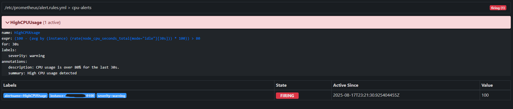

# monitoring-alerting-stack
This project demonstrates how to monitor a Linux server using Prometheus, Node Exporter, and Grafana, and how to configure Alertmanager for real-time anomaly detection and alerts.

## Objectives

Collect real-time server metrics (CPU, memory, disk, network).

Visualize data in Grafana dashboards.

Set up custom alert rules in Prometheus.

Trigger and receive alerts via Alertmanager (email).

## Environment

Ubuntu Server (Monitored host)

Prometheus

Node Exporter

Grafana

Alertmanager

## Setup Instructions

See setup/ for detailed installation and configuration steps for Prometheus, Node Exporter, Grafana, and Alertmanager.

## Observations

See screenshots/ and logs/ for Grafana dashboard outputs, alert emails, and system metrics.

## Prometheus Alerts
When CPU usage goes above 80%, the alert will fire.  
Example:

